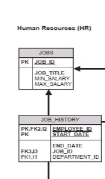
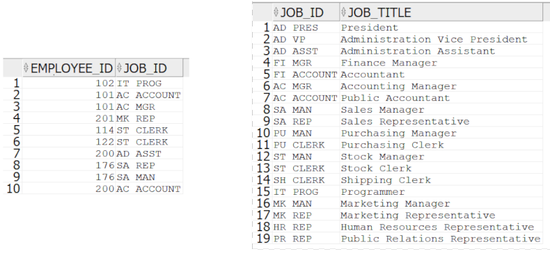

# Foreign keys

## Definitie

Foreign key-urile sunt constrangeri la nivel de tabel care fac legatura dintre 2 tabele prin intermediul a una sau mai multe coloane.

## Exemplu

Din [diagrama HR](https://github.com/PVDoriginal/TutoriatBD2025/blob/Sapt-1/Diagrama%20HR/diagrama_HR.pdf) am extras urmatoarea relatie:


Sageata de la job_history la jobs este reprezentata de foreign key-ul job_id din job_history care referentiaza job_id din jobs.

Constrangerea asta se asigura ca pentru fiecare entry/rand din job_history, la coloana job_id se va afla un job_id existent in jobs.

Fie urmatoarele date(stanga job_history, dreapta jobs)




Observam ca fiecarui job_id din job_history ii corespunde un job_id din jobs.

Daca incercam sa inseram in job_history randul cu datele (103, HR MAN) vom primi o eroare deoarece HR MAN nu exista in tabelul jobs. Chestia asta ramane adevarata si pentru update-uri.

Daca incercam sa stergem din jobs un entry referentiat de job_history o sa primim de asemenea o eroare. Ex: stergem randul 13 (ST_CLERK, Stock Clerk), randul acesta este referentiat in jobs_history de randurile 5 si 6 din jobs, astfel stergerea lui ar lasa referinte plutitoare, de aceea oracle ne atentioneaza cu o eroare.

## Sintaxa

### Creere

Putem creea foreign key-uri cand cream un tabel:

```
CREATE TABLE job_history(
    /*coloane irelevante*/

    job_id NUMBER(4),
    CONSTRAINT job_history_job_id_fk FOREIGN KEY (job_id) REFERENCES jobs(job_id)
);
```

Sintaxa generala este:

```
CONSTRAINT nume_constrangere FOREIGN KEY (col1, col2, ..., coln) REFERENCES [nume tabel referentiat](col1, col2, ..., coln)
```

Sau dupa creearea tabelului

```
ALTER TABLE job_history ADD CONSTRAINT job_history_job_id_fk FOREIGN KEY (job_id) REFERENCES jobs(job_id);
```

Sintaxa generala
```
ALTER TABLE nume_table ADD CONSTRAINT nume_constrangere FOREIGN KEY (col1, col2, ..., coln) REFERENCES [nume tabel referentiat](col1, col2, ..., coln)
```

### Stergere
Forma generala
```
ALTER TABLE nume_tabel DROP CONSTRAINT nume_constrangere;
```

### ON DELETE CASCADE VS ON DELETE RESTRICT

Am discutat mai devreme ca daca stergem din jobs un entry care e referentiat de jobs_history primim eroare. Asta se intampla deoarece atunci cand cream constrangerea implicit este setata pe ON DELETE RESTRICT. Daca o setam manual pe ON DELETE CASCADE nu mai primim eroare si se va sterge entry-ul atat din jobs cat si din job_history.

#### Sintaxa updata:

```
CONSTRAINT nume_constrangere FOREIGN KEY (col1, col2, ..., coln) REFERENCES [nume tabel referentiat](col1, col2, ..., coln) ON DELETE CASCADE/RESTRICT
```