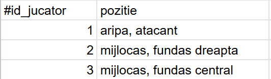
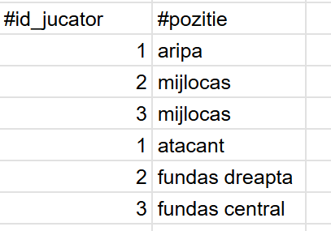
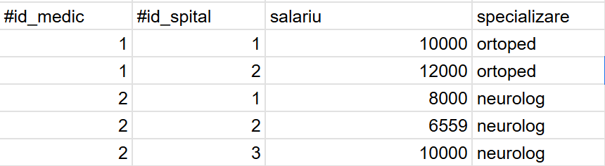
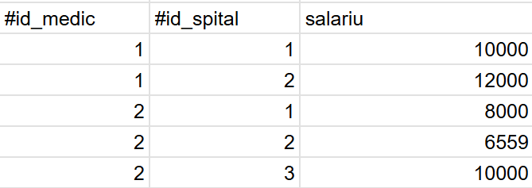
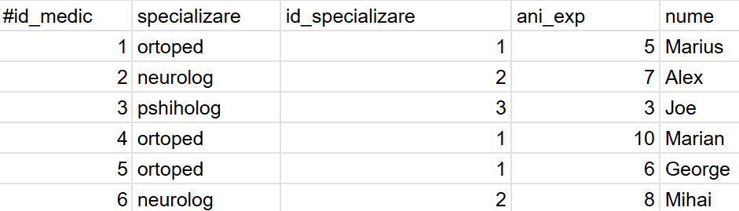
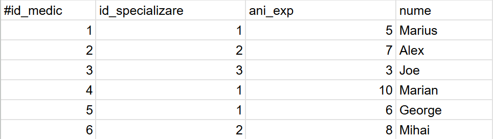
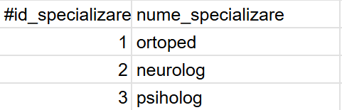

# Normalizare si denormalizare

## Normalizarea

- Procesul prin care sunt eliminate redundantele dintr-o baza de date pentru evitarea anomaliilor la inserarea, actualizarea si stergerea datelor si folosirea unui nivel mai mic de stocare.

### Forme Normale

#### FN1 - Forma Normala 1

Fiecare coloana al fiecarui rand din baza de date are o singura valoare

Exemplu:

Inainte de normalizare

Pozitii_juc

Dupa normalizare

Pozitii_juc

#### FN2 - Forma Normala 2

Coloanele(dintr-un tabel) care nu fac parte din cheia primara sunt dependente de intreaga cheie primara

Exemplu:

Inainte de normalizare

Medic

Dupa normalizare

Medic

Specializare

#### FN3 - Forma Normala 3

Coloanele care nu fac parte din cheia primara sunt dependente de intreaga cheie primara si doar de ea.

Exemplu:

Inainte de normalizare

Medic

Dupa normalizare

Medic

Specializare

## Denormalizare

Procesul invers normalizarii, folositor cand vrem o baza de date mai simpla cu acces mai rapid la date (o baza de date care face mai multe read-uri decat write-uri).